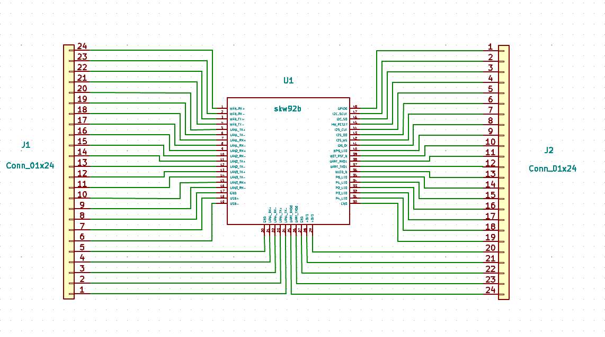
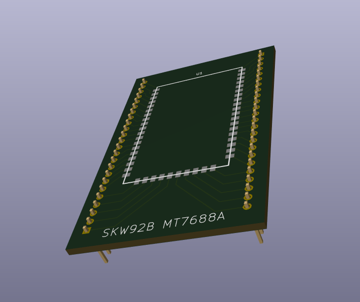

# Breadboard adapter for SKW92B WiFi module

Kicad project for [SKW92B](http://www.skylab.com.cn/uploadfile/Download/SkyLab_SKW92B_V1.06_datasheet.pdf) MT7688a WiFi module breadboard adapter.
SKW92B module integrates a 1x1 802.11n Wi-Fi radio, 580MHz MIPS CPU, 1-port Ethernet PHY, USB2.0 host, I2C/PCM and multiple slow GPIOs. 

Adapter schematics:

Adapter 3D view:

